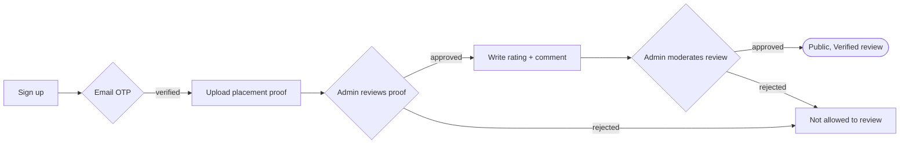
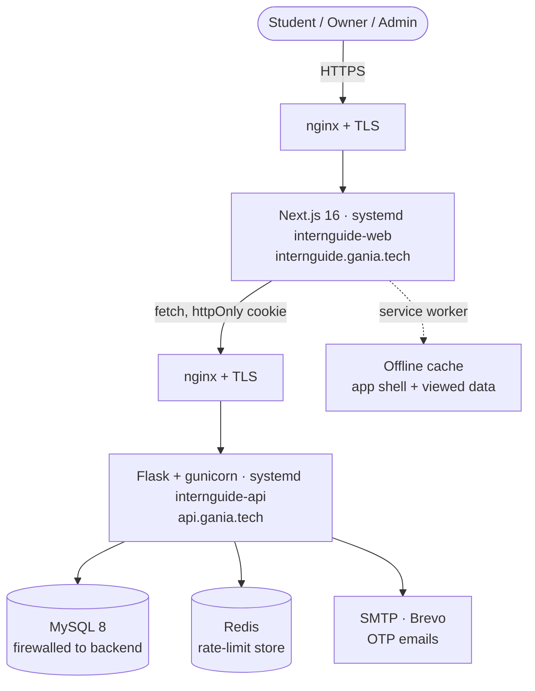

<div align="center">


# InternGuide

### Know the internship before you sign

Verified internship reviews for students in Rwanda. Real ratings on mentorship,
tasks, learning and environment, from people who actually did the work.

<br/>

[](https://internguide.gania.tech)
[](https://api.gania.tech/docs)

<br/>


<em>Built by <strong>team THE GRID</strong>, African Leadership University</em>

</div>

---

## Table of contents

- [What it is](#what-it-is)
- [Feature tour](#feature-tour)
- [How the trust model works](#how-the-trust-model-works)
- [Architecture](#architecture)
- [Tech stack](#tech-stack)
- [Repository layout](#repository-layout)
- [Run it locally](#run-it-locally)
- [Environment variables](#environment-variables)
- [API reference](#api-reference)
- [Testing](#testing)
- [Accessibility and PWA](#accessibility-and-pwa)
- [CI/CD](#cicd)
- [Production infrastructure](#production-infrastructure)
- [Team](#team)

---

## What it is

Internship reviews are usually word of mouth. InternGuide turns them into a
verified, searchable public record:

1. A student uploads proof they interned somewhere (offer letter or certificate).
2. An admin checks the proof, then the file is deleted. Only a green Verified badge remains.
3. The verified student rates the company across four categories, and the
   review goes public after moderation.

The result: prospective interns can compare companies on real, accountable data
instead of rumours, and everything is designed mobile-first for students on
low-bandwidth connections.

---

## Feature tour

| Area | What you get |
| --- | --- |
| Discover | Search and filter companies by pay, location, hours and perks; sortable, paginated listing. |
| Verified reviews | Four-category ratings (mentorship, tasks, learning, environment) with an auto-computed overall score; owner replies. |
| Two-tier verification | Proof-of-placement badge and email-confirmed accounts (see [below](#how-the-trust-model-works)). |
| Compare | Select up to 3 companies and see them side by side. |
| Bookmarks | Students save companies to a personal Saved page. |
| Roles | Distinct experiences for students, company owners, and admins. |
| Company owners | Register a business, manage the profile, post internships, reply to reviews. |
| Admin moderation | Approve and reject companies, proofs and reviews from one queue. |
| Account security | JWT httpOnly cookies, email verification OTP, forgot-password OTP by email. |
| Rate limiting | Redis-backed limits shared across workers, real client IP behind nginx. |
| PWA and offline | Installable to the home screen; previously-viewed pages work with no signal. |
| Accessibility | WCAG 2.2 AA, enforced by automated checks in CI. |
| API docs | OpenAPI 3.0 spec served through Swagger UI at [`/docs`](https://api.gania.tech/docs). |

---

## How the trust model works

InternGuide has two independent kinds of "verified". They are often confused, so
here they are side by side:

| | Email verification | Proof-of-placement verification |
| --- | --- | --- |
| Question it answers | "Is this a real email owner?" | "Did this person really intern there?" |
| Column | `users.email_verified` | `verification_proofs.status = approved` |
| How | 6-digit OTP emailed on signup | Admin reviews an uploaded document |
| Blocks | Logging in until confirmed | Reviewing a company until approved |
| Badge | none | Green Verified on the review |

### Review lifecycle



Proof files are accepted as PDF, PNG or JPG (max 5 MB) and deleted once reviewed.
Only the decision is kept, for privacy. The overall score is the mean of the four
category ratings, rounded to one decimal (`ROUND_HALF_UP`). A company's headline
average is `AVG(rating)` across its public reviews, recomputed on every change.

---

## Architecture

Frontend, backend and database are self-hosted on separate servers, all behind
HTTPS, sharing one auth cookie across the `gania.tech` subdomains.



Why a shared cookie? The auth JWT is issued for `.gania.tech`, so the browser
sends it to both `internguide.gania.tech` (frontend) and `api.gania.tech`
(backend) even though they are different subdomains.

---

## Tech stack

<table>
<tr><th>Frontend</th><th>Backend</th><th>Infra and tooling</th></tr>
<tr valign="top">
<td>

- Next.js 16 (App Router)
- React 19 + TypeScript
- Tailwind CSS 3
- Sonner (toasts)
- ECharts (stats)
- Playwright + Vitest

</td>
<td>

- Flask (blueprints)
- MySQL 8 (`mysql-connector`)
- JWT httpOnly cookies
- Flask-Limiter + Redis
- flask-swagger-ui / OpenAPI 3
- pytest

</td>
<td>

- gunicorn + systemd
- nginx reverse proxy
- Let's Encrypt (certbot)
- GitHub Actions (CI/CD)
- ProxyFix (real client IP)
- Brevo SMTP

</td>
</tr>
</table>

---

## Repository layout

```
intern_guide/
├── frontend/                Next.js app
│   ├── app/                 routes (App Router) + manifest + globals
│   ├── components/          ui, layout, company, home, auth, providers, pwa
│   ├── lib/                 api client, validation, labels, utils
│   ├── e2e/                 Playwright: a11y + PWA + keyboard specs
│   ├── tests/               Vitest unit tests
│   └── public/              icons, service worker, offline page
├── backend/                 Flask API
│   ├── app/
│   │   ├── routes/          auth, search, review, rating, manage,
│   │   │                    moderation, verification, bookmarks, stats
│   │   ├── services/        rating math
│   │   ├── utils/           decorators (roles), mailer, uploads
│   │   ├── config.py        env-driven config
│   │   ├── extensions.py    Flask-Limiter
│   │   ├── security.py      security headers
│   │   └── openapi.yaml     API spec (served at /docs)
│   └── tests/               pytest
├── database/
│   ├── schema.sql           full schema (10 tables)
│   ├── seed.sql             demo data (1 admin, 8 owners, 18 students)
│   └── add_*.sql            incremental migrations
├── docs/                    ACCESSIBILITY.md (+ this README)
└── .github/workflows/       ci.yml, deploy.yml
```

Each side owns its dependencies: run `npm` from `frontend/`, Python from `backend/`.

---

## Run it locally

Prerequisites: Node 20+, Python 3.10+, MySQL 8+. Redis and SMTP are optional
locally; the app degrades gracefully without them.

### 1. Database

```bash
mysql -u root -p < database/schema.sql      # creates the internguide DB + tables
mysql -u root -p internguide < database/seed.sql
```

### 2. Backend, Flask on port 5001

```bash
cd backend
python3 -m venv .venv && source .venv/bin/activate
pip install -r requirements.txt
cp .env.example .env                  # then fill in the values (see below)
flask --app app run --port 5001       # health check: curl localhost:5001/health
```

On macOS, port 5000 is taken by AirPlay, which is why the backend runs on 5001.

### 3. Frontend, Next.js on port 3000

```bash
cd frontend
npm install
echo "NEXT_PUBLIC_API_URL=http://localhost:5001" > .env.local
npm run dev
```

Open http://localhost:3000

### Seed logins

Every seed account uses the password `Password123`:

| Email | Role |
| --- | --- |
| `admin@internguide.rw` | admin, moderation queue, manage companies |
| `grace@kivusoftware.rw` | company owner, owner dashboard, replies |
| `aline@alustudent.com` | student, verified, can write reviews |
| `sandrine@alustudent.com` | student, not verified, sees the proof-upload flow |

---

## Environment variables

<details>
<summary><strong>Backend</strong> (<code>backend/.env</code>)</summary>

<br/>

| Variable | Purpose | Local default |
| --- | --- | --- |
| `SECRET_KEY` | JWT signing secret (generate your own) | none |
| `FRONTEND_ORIGIN` | CORS origin for the frontend | `http://localhost:3000` |
| `DB_HOST` / `DB_USER` / `DB_PASSWORD` / `DB_NAME` | MySQL connection | `localhost` / `root` / _(empty)_ / `internguide` |
| `COOKIE_SECURE` | `true` in production (needs HTTPS) | `false` |
| `COOKIE_DOMAIN` | share cookie across subdomains (`.gania.tech`) | _(empty)_ |
| `REDIS_URL` | rate-limit store; unset means per-process memory | _(unset)_ |
| `SMTP_HOST` ... `SMTP_FROM_NAME` | email for OTP codes; empty turns emailing off | _(empty)_ |

Generate a secret: `python3 -c "import secrets; print(secrets.token_hex(32))"`

</details>

<details>
<summary><strong>Frontend</strong> (<code>frontend/.env.local</code>)</summary>

<br/>

| Variable | Purpose | Local value |
| --- | --- | --- |
| `NEXT_PUBLIC_API_URL` | base URL of the Flask API | `http://localhost:5001` |

In production this points to `https://api.gania.tech`.

</details>

---

## API reference

Full interactive docs (OpenAPI 3.0 via Swagger UI): <https://api.gania.tech/docs>

<details>
<summary>Endpoints by area</summary>

<br/>

Auth (`/auth`): `register`, `login`, `logout`, `me`, `verify-email`,
`resend-verification`, `forgot-password`, `verify-reset-code`, `reset-password`

Companies and search (`/companies`): list and filter, detail, `compare`

Reviews: `POST/GET /reviews`, `/me/reviews`, `/me/placements`, `/me/proofs`,
review replies

Bookmarks: `/me/bookmark-ids`, `/me/bookmarks` (list, add, remove)

Company management: register a business, edit, post internships, `/me/company`

Verification: `POST /verification-proofs`

Moderation (`/admin`): review and proof queues, approve/reject, company
approve/reject/activate/deactivate/delete

Stats: `/stats/summary`, `/companies/{id}/stats`

</details>

Roles are enforced server-side with a `@role_required(*roles)` decorator that
populates `g.current_user` from the JWT cookie.

---

## Testing

| Suite | Command | What it covers |
| --- | --- | --- |
| Backend | `pytest -q` (in `backend/`) | 21 tests: auth, reviews, moderation |
| Frontend unit | `npm test` (in `frontend/`) | Vitest: validation logic |
| Accessibility lint | `npm run lint:a11y` | eslint-plugin-jsx-a11y |
| E2E (a11y + PWA) | `npm run test:a11y` | Playwright + axe-core, public pages |
| E2E incl. logged-in pages | `E2E_AUTH=1 npm run test:a11y` | every route, all 3 roles |

The e2e suite scans every page for WCAG A/AA violations, verifies the PWA
(installable, service worker, offline fallback, cached-page-offline), and checks
keyboard operability (skip link, menu, star ratings).

---

## Accessibility and PWA

- Accessibility: targets WCAG 2.2 AA. Visible focus rings, skip link,
  reduced-motion, AA-contrast tokens, an accessible star-rating radio group,
  announced form errors. Enforced in CI (jsx-a11y + axe on every route).
  Full details: [`docs/ACCESSIBILITY.md`](docs/ACCESSIBILITY.md).
- PWA: a web manifest + brand icons make it installable; a hand-written service
  worker caches the app shell, static assets and viewed API data
  (stale-while-revalidate), with a branded offline page and an offline banner.

---

## CI/CD

Two GitHub Actions workflows:

- `ci.yml` (every PR and push to `develop`/`main`): backend tests, a11y lint,
  public axe scan, and a full-stack job that stands up MySQL + Flask + Next on
  localhost to scan the authenticated pages.
- `deploy.yml` (push to `main`): runs backend tests, then deploys the backend
  and frontend over SSH and health-checks them.

Branch flow: `feature/* -> develop -> main`. Both `develop` and `main` are
protected and require review; merging to `main` triggers the production deploy.

---

## Production infrastructure

Everything is self-hosted on AWS EC2 (Ubuntu), no PaaS:

| Server | Role | Runs |
| --- | --- | --- |
| `internguide.gania.tech` | Frontend | Next.js under `systemd` (`internguide-web`, port 3000), nginx + TLS |
| `api.gania.tech` | Backend | Flask + gunicorn under `systemd` (`internguide-api`, port 8000), nginx + TLS |
| _(private)_ | Database | MySQL 8, firewalled to the backend only |

- HTTPS via Let's Encrypt (certbot), auto-renewed.
- `COOKIE_DOMAIN=.gania.tech` shares the auth cookie across subdomains.
- Redis backs the rate limiter so limits are shared across gunicorn workers;
  ProxyFix gives Flask the real client IP behind nginx.
- Deploys are zero-touch: merge to `main`, then GitHub Actions SSHes in, pulls,
  rebuilds, restarts the services, and health-checks them.

---

## Team

THE GRID, African Leadership University.
Verified internship reviews, by interns, for interns.

<div align="center">
<br/>
<sub>Next.js · Flask · MySQL · self-hosted on AWS</sub>
</div>
